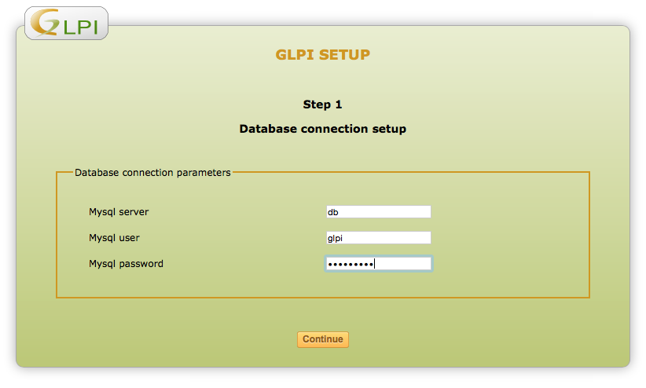

# GLPI deploy with Docker

Deploy and run GLPI (any version) with Docker.

Install latest version by default but you can specify the version you want by passing

You can:
- link to an existing database.
- or create a new one easily with docker-compose.

## Deploy GLPI only (no database)

```docker run -it -d -p 80:80 driket54/glpi```

## Deploy with docker-compose

You can deploy GLPI + database by creating 2 files:
- **docker-compose.yml**
- **glpi.env**

### docker-compose.yml ###

```yml
glpi:
  image: driket54/glpi
  ports:
    - "8090:80"
  links:
    - mysql:db
  env_file:
    - ./glpi.env

mysql:
  image: mariadb
  env_file:
    - ./glpi.env
```

glpi.env

```env
MYSQL_ROOT_PASSWORD=rootpasswd
MYSQL_DATABASE=glpi
MYSQL_USER=glpi
MYSQL_PASSWORD=glpipaswd
GLPI_SOURCE_URL=https://forge.glpi-project.org/attachments/download/2020/glpi-0.85.4.tar.gz
```

### Run docker-compose

```bash
docker-compose build
docker-compose up
```

### Configure new database

Access your container with HTTP.
Use infos you setup in glpi.env file



## FAQ

### Do I have to use Mariadb?

Nope, you can replace with mysql image in docker-compose.yml if prefer

### How to make my database persistent?

Check docker-compose.sample.yml.

Basically, you need to create a data container that won't be destroyed at each deployment.

### How can I install a different version of GLPI?

- Choose a version at: https://forge.glpi-project.org/projects/glpi/files
- Copy URL and paste it in glpi.env:

```
GLPI_SOURCE_URL=https://forge.glpi-project.org/attachments/download/2020/glpi-0.85.4.tar.gz
```

- Run ```docker-compose build```
- Run ```docker-compose up```
